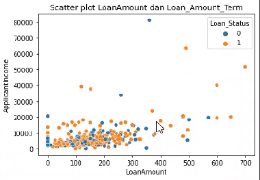

# Loan Prediction with KNN  
A machine learning project that uses the K-Nearest Neighbors (KNN) algorithm to predict the relationship between an applicant's loan amount and income to the loan approval status, which is predicted using the K-Nearest Neighbors (KNN) algorithm.
I used Loan Prediction dataset in csv form from https://raw.githubusercontent.com/Wayan123/dataset-ml/main/loan_prediction.csv

# Visualization 
This visualization illustrates the relationship between the borrower's income and the amount of loan he applied for after being predicted using KNN.

# 
